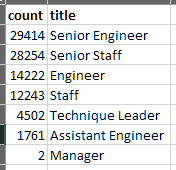
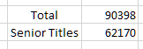
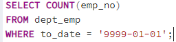
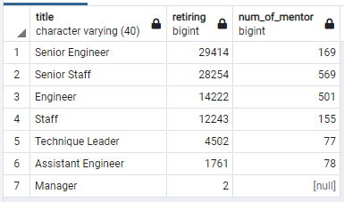

# bootcamp_challenge7
## Overview of the analysis: Explain the purpose of this analysis.
This analysis is to determine the number of retiring employees per title, and identify employees who are eligible to participate in a mentorship program. 
## Results: Provide a bulleted list with four major points from the two analysis deliverables. Use images as support where needed.

- By searching employees with birth date between January 1, 1952 and December 31, 1955, it has been determined that there are 90,398 employees retiring.
 

 

 
- Using the following query, it is found that the number of current employees is 240,124. Therefore, retiring employees is 37.6% of the current employees.
 
 

 
 
- Among the 90,398 retiring employees, 62,170 carry a senior title including Senior Engineer, Senior Staff, and Technical Leader, which is 25.9% of the current employees.
 
 
- The number of eligible employees for the mentorship program is 1,549, which is much less than the retiring employees.
 
 

## Summary: Provide high-level responses to the following questions, then provide two additional queries or tables that may provide more insight into the upcoming "silver tsunami."
- How many roles will need to be filled as the "silver tsunami" begins to make an impact? 
 
 
As shown in the above tables, 90,398 roles will need to be filled.
 
 
- Are there enough qualified, retirement-ready employees in the 
departments to mentor the next generation of Pewlett Hackard employees?
 
 
Also as shown in the above tables, the number of retirement-ready mentors are significantly less than the number of new hires replacing the retiring employees (only 1.7% by ratio). It might be necessary to invite employees born other than year 1965 to enter the mentorship program.